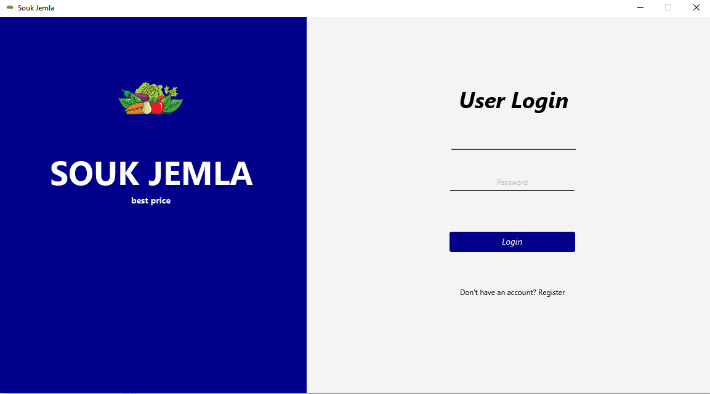
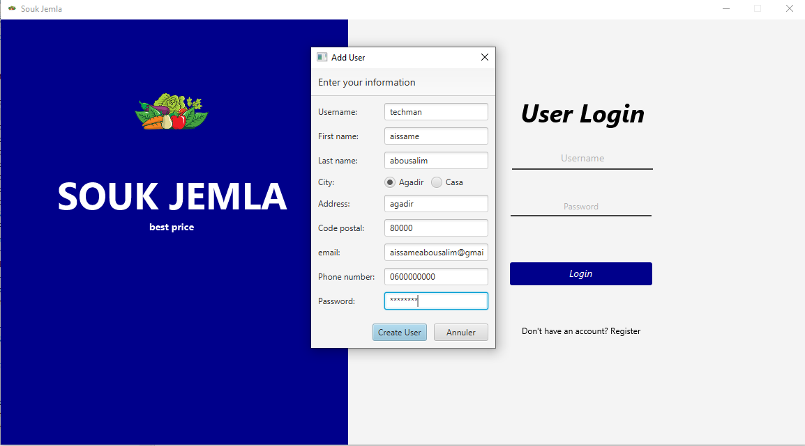
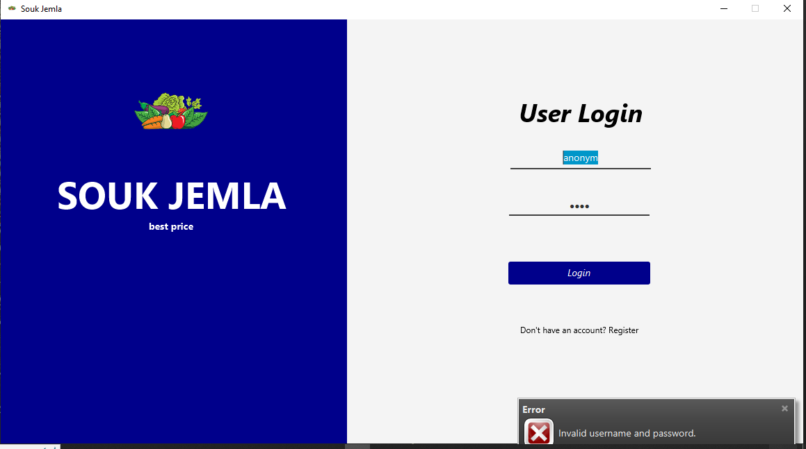
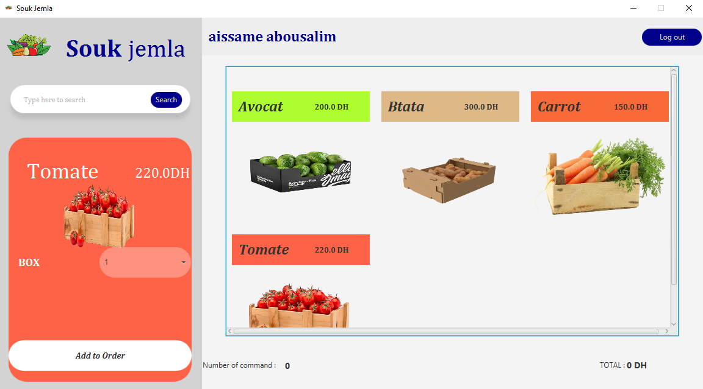
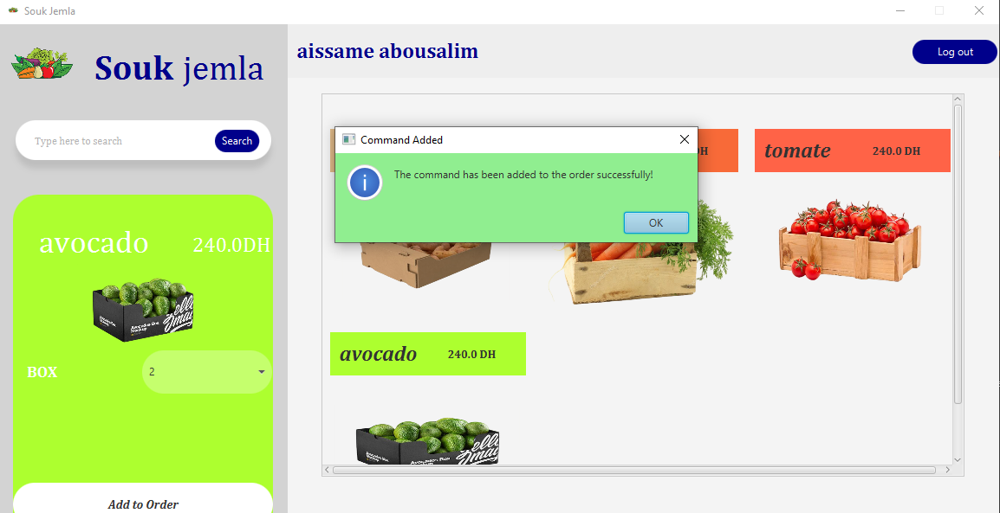

# Souk Jemla - Distributed Oracle Database Connector

## Introduction

In scenarios where geographical distance introduces significant latency, traditional centralized databases may not deliver optimal performance for users in different locations. Souk Jemla addresses this challenge by utilizing distributed pluggable databases on Oracle 18, enabling data access and transactions with reduced latency for users in Agadir and Casa.

## Features

- **Distributed Database Connectivity**: Souk Jemla connects to Oracle 18's distributed pluggable databases to reduce latency for specific user groups.

- **JavaFX User Interface**: The application offers a user-friendly JavaFX interface for easy interaction.

- **Customizable Configuration**: You can customize database connections and other settings to suit your specific requirements.

- **Performance Optimization**: Souk Jemla is designed to improve performance and responsiveness for users accessing the distributed database.

## Getting Started

To get started with Souk Jemla, follow these steps:

1. **Clone the Repository**:
   ```shell
   git clone https://github.com/yourusername/souk-jemla.git
   cd souk-jemla

2. **Simulation images**:
   
   
   
   
   
